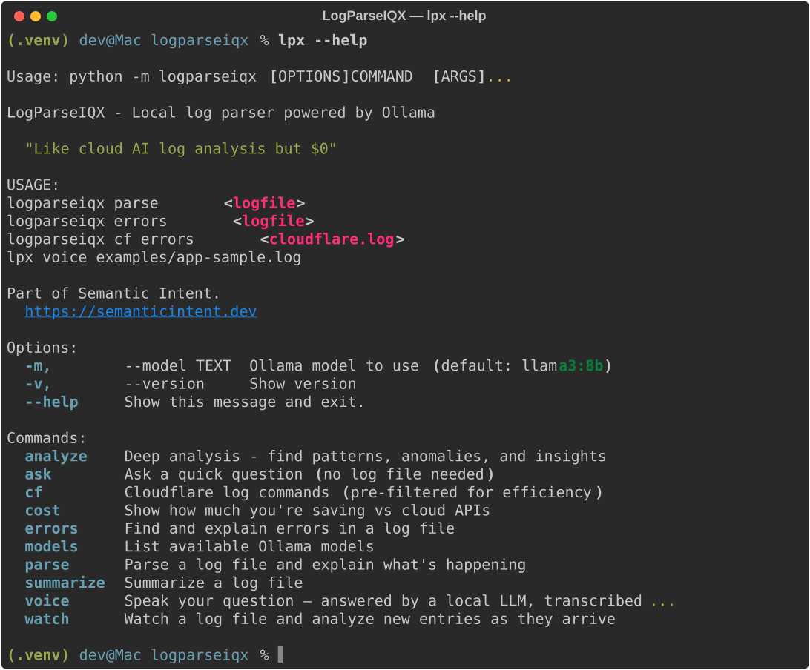

# LogParseIQX

[](https://github.com/semanticintent/logparseiqx/actions/workflows/test.yml)
[](https://github.com/semanticintent/logparseiqx)
[](https://www.python.org/downloads/)
[](https://opensource.org/licenses/MIT)

> **"Like cloud AI log parsing but $0"**
>
> *grep with intelligence*

A local CLI log parser powered by [Ollama](https://ollama.com). Runs entirely on your machine. No tokens. No API costs. Just results.

Part of [Semantic Intent](https://semanticintent.dev).



---

## Features

- **Generic log parsing** - Works with any log format
- **Cloudflare-specific commands** - Pre-filtered for efficiency
- **Local LLM powered** - Uses Ollama (Qwen, Mistral, Phi-3, etc.)
- **$0 cost** - No API fees, no token limits
- **Smart pre-filtering** - Reduces context before sending to LLM
- **Beautiful CLI** - Rich terminal output

---

## Installation

### Prerequisites

1. **Install Ollama**
   ```bash
   # Windows
   winget install Ollama.Ollama

   # macOS
   brew install ollama

   # Linux
   curl -fsSL https://ollama.com/install.sh | sh
   ```

2. **Pull a model**
   ```bash
   # Lightweight (recommended for 8GB RAM)
   ollama pull qwen2.5:3b

   # Better quality (needs more RAM)
   ollama pull mistral:7b
   ```

3. **Start Ollama**
   ```bash
   ollama serve
   ```

### Install LogParseIQX

```bash
# Clone the repo
git clone https://github.com/semanticintent/logparseiqx.git
cd logparseiqx

# Install in editable mode
pip install -e .

# Verify installation
logparseiqx --version
```

Or install directly from GitHub:

```bash
pip install git+https://github.com/semanticintent/logparseiqx.git
```

---

## Usage

### Quick Start

Sample log files are included in the `examples/` directory so you can try it immediately:

```bash
# Analyze a generic app log
lpx parse examples/app-sample.log

# Find errors and get a root cause explanation
lpx errors examples/app-sample.log

# Ask a specific question about a log
lpx parse examples/app-sample.log -q "Why did the login endpoint fail?"

# Cloudflare: find HTTP errors
lpx cf errors examples/cloudflare-sample.log

# Cloudflare: check for security threats
lpx cf security examples/cloudflare-sample.log

# Cloudflare: performance overview
lpx cf summary examples/cloudflare-sample.log
```

### Generic Commands

```bash
# Parse and explain a log file
logparseiqx parse <logfile>
logparseiqx parse <logfile> --question "What happened at 3pm?"
logparseiqx parse <logfile> --tail 500  # Last 500 lines only

# Summarize a log file
logparseiqx summarize <logfile>

# Find and explain errors
logparseiqx errors <logfile>

# Deep analysis (patterns, anomalies, timeline)
logparseiqx analyze <logfile>

# Ask anything
logparseiqx ask "What does a 502 error mean?"
```

### Cloudflare Commands

Specialized commands for Cloudflare JSON logs with smart pre-filtering:

```bash
# Find HTTP errors (4xx, 5xx)
logparseiqx cf errors cloudflare.log
logparseiqx cf errors cloudflare.log --status 502  # Only 502s

# Find slow requests
logparseiqx cf slow cloudflare.log
logparseiqx cf slow cloudflare.log --threshold 2000  # >2 seconds

# Security events (WAF, threats, blocks)
logparseiqx cf security cloudflare.log
logparseiqx cf security cloudflare.log --threat-score 20

# Cache efficiency and edge vs origin latency
logparseiqx cf performance cloudflare.log
logparseiqx cf performance cloudflare.log --threshold 500  # Flag requests >500ms

# Top requesting IPs (find bots/abuse)
logparseiqx cf top-ips cloudflare.log --limit 30

# Quick traffic summary
logparseiqx cf summary cloudflare.log
```

### Voice Mode

Speak your question instead of typing it. Transcribed locally via [faster-whisper](https://github.com/SYSTRAN/faster-whisper). Nothing leaves your machine.

**Install:**
```bash
pip install logparseiqx[voice]
```

> First run downloads the Whisper `base` model (~150MB, cached after that).

**Usage:**
```bash
# Speak a general question
lpx voice

# Speak a question about a specific log file
lpx voice examples/app-sample.log

# Also works as a flag on lpx ask
lpx ask --voice
lpx ask --voice examples/app-sample.log  # not valid — use lpx voice for files

# Use a smaller/faster model for quicker transcription
lpx voice --whisper tiny

# Save both the question and the answer
lpx voice --output incident-notes.md
```

**Flow:**
1. Press Enter to start recording
2. Speak your question
3. Press Enter to stop
4. Transcription shown: `[You]: why is /api/auth returning 500?`
5. Streamed answer from your local LLM

**Why local?** Your logs contain sensitive infrastructure details. Your questions about those logs are equally sensitive. Both stay on your machine.

### Watch Mode

Watch a log file live and get LLM analysis as new lines arrive:

```bash
# Watch any log file (default: check every 10s)
lpx watch /var/log/app.log

# Faster polling, larger batch
lpx watch /var/log/nginx/access.log --interval 5 --batch 100

# Suppress "no new lines" messages
lpx watch app.log --quiet
```

Seeks to the **end of the file** on start — only new content is analyzed. Press `Ctrl+C` to stop.

### Save Output

Add `--output` / `-o` to any command to save the LLM response to a file:

```bash
# Save analysis to a markdown file
lpx parse app.log --output report.md

# Save Cloudflare security report
lpx cf security cloudflare.log --output security-report.txt

# Save summary for sharing
lpx summarize server.log -o summary.md
```

### Other Commands

```bash
# List available models
logparseiqx models

# See cost comparison
logparseiqx cost

# Use a different model
logparseiqx --model mistral:7b parse app.log
lpx -m phi3:mini errors server.log
```

---

## Cost Comparison

| Service | Cost/1M tokens | 500MB log file |
|---------|----------------|----------------|
| Cloud AI APIs | $15-90 | $437-$2,625 |
| **LogParseIQX (local)** | $0 | **$0** |

The savings add up quickly when parsing logs regularly.

---

## How Cloudflare Filtering Works

The key to efficient log parsing is reducing context before sending to the LLM:

```
Raw Cloudflare Log (50+ fields, 1000s of lines)
                    |
                    v
        PRE-FILTER (Python) - No LLM needed
        * Only 4xx/5xx errors
        * Only slow requests
        * Only security events
                    |
                    v
        COMPACT FORMAT (50 fields -> 6 fields)
        timestamp|method|uri|status|IP|ray_id
                    |
                    v
        Local LLM (small context, fast)
                    |
                    v
        Actionable insights
```

---

## Recommended Models

Start here if you have nothing installed yet:

```bash
ollama pull llama3:8b    # Best all-around for log analysis (~5GB)
```

**By RAM:**

| RAM | Recommended | Command |
|-----|-------------|---------|
| 8GB | Llama 3 8B | `ollama pull llama3:8b` |
| 16GB | Gemma 4 12B | `ollama pull gemma4:12b` |
| 32GB+ | Gemma 4 27B | `ollama pull gemma4:27b` |

**Set your model:**
```bash
export LOGPARSEIQX_MODEL=llama3:8b
lpx parse examples/app-sample.log
```

Or per-command: `lpx --model gemma4:27b cf errors cloudflare.log`

---

## Project Structure

```
logparseiqx/
├── pyproject.toml           # Package configuration
├── README.md
├── LICENSE
├── src/
│   └── logparseiqx/
│       ├── __init__.py      # Version, banner
│       ├── __main__.py      # python -m entry point
│       ├── cli.py           # Main CLI commands
│       ├── parsers/
│       │   ├── __init__.py  # Generic log utilities
│       │   └── cloudflare.py # Cloudflare-specific
│       └── utils/
│           └── __init__.py  # Ollama integration
└── tests/
```

---

## Configuration

### Environment variables

| Variable | Default | Description |
|----------|---------|-------------|
| `LOGPARSEIQX_MODEL` | `qwen2.5:3b` | Default Ollama model |
| `OLLAMA_HOST` | `http://localhost:11434` | Ollama server URL |
| `OLLAMA_MODELS` | *(Ollama default)* | Model storage path |

```bash
# Use a different default model
export LOGPARSEIQX_MODEL=mistral:7b
lpx parse app.log

# Point at a remote Ollama instance
export OLLAMA_HOST=http://my-gpu-server:11434
lpx cf errors cloudflare.log

# Override model per-command
lpx --model phi3:mini errors server.log
```

### Store models on external SSD

```bash
export OLLAMA_MODELS=/path/to/external/ssd/ollama/models
```

---

## Contributing

Contributions welcome! See [CONTRIBUTING.md](CONTRIBUTING.md) for guidelines.

Ideas for future parsers:

- [ ] Nginx access logs
- [ ] Apache logs
- [ ] AWS CloudWatch
- [ ] Docker/Kubernetes logs
- [ ] Application-specific (Rails, Django, Express)

---

## License

MIT License - see [LICENSE](LICENSE) for details.

---

## Credits

- [Ollama](https://ollama.com) - Local LLM runtime
- [Click](https://click.palletsprojects.com/) - CLI framework
- [Rich](https://rich.readthedocs.io/) - Beautiful terminal output

---

## Links

- **Website**: [semanticintent.dev](https://semanticintent.dev)
- **GitHub**: [github.com/semanticintent/logparseiqx](https://github.com/semanticintent/logparseiqx)
- **Issues**: [Report bugs or request features](https://github.com/semanticintent/logparseiqx/issues)

---

<p align="center">
  <b>Part of Semantic Intent</b>
</p>
